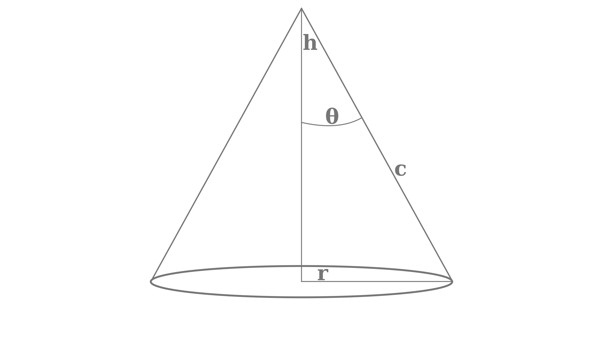

---
jupytext:
  text_representation:
    extension: .md
    format_name: myst
    format_version: 0.13
    jupytext_version: 1.14.0
kernelspec:
  display_name: Python 3 (ipykernel)
  language: python
  name: python3
---

(assign3a_solution)=
# Assignment 3a -- Solution

Do these questions on paper and scan for upload a pdf created using one of these [scanning apps](https://help.gradescope.com/article/0chl25eed3-student-scan-mobile-device)

+++

#

+++ {"tags": []}

# Q1: Flux from radiance  (8 points)

Suppose a satellite is looking at the surface with the following field of view:



Where h = 800 km and r = 5 km

We know from  {ref}`flux_from_radiance` eq. 5 that the flux is given by:

$$
dE^\prime = L \cos \theta^\prime d \omega^\prime = L \cos \theta^\prime \sin \theta^\prime d \theta^\prime d\phi^\prime
$$ 

so that if we interate for all angles $\theta^\prime$ within the cone's field of view we would get the total flux reaching the sensor:

$$
E = \int dE = \int_0^{2\pi} \int_0^{\theta} \cos \theta^\prime \, L \, d \omega^\prime =\int_0^{2\pi} \int_0^{\theta} L \cos \theta^\prime  \sin \theta^\prime \, d\theta^\prime \, d \phi^\prime 
$$

+++

### Q1a (2 points)

Use the change of variables $\mu^\prime = \cos \theta^\prime$ to change this integral into a integral with respect to $d\mu^\prime$ and $d\phi^\prime$

+++

Q1a Answer

$$
\mu = \cos \theta \\
d\mu = -\sin \theta d\theta \\
E = \int_0^{2\pi} \int_0^1 L \mu^\prime d\mu^\prime d\phi^\prime = 2 \pi \int_\mu^1 L \mu^\prime d\mu^\prime d\phi^\prime = 2 \pi \; \frac{\mu^\prime}{2} 
\bigg \rvert_\mu^1 =   2 \pi L \left ( \frac{1 - \mu^2}{2} \right )
$$
assuming that $L$ is constant over the limits of the integral

+++

### Q1b (2 points)

Evaluate this intergral for the limit $\theta$ appropriate for the h=800 km and r=5 km case mentioned above.

+++

$\theta = \arctan \left ( \frac{r}{h} \right )$

Evaluate using python:

```{code-cell} ipython3
import numpy as np
theta = np.arctan(5/800)
the_mu = np.cos(theta)
del_omega = 2*np.pi*(1 - (the_mu**2.))/2.
print(f"Q1b answer: {theta=:5.3f} rad, {the_mu=:9.6f}, {del_omega=:6.4g} sr")
```

### Q1c (2 points)

Compare the answer you get from Q2a with the following simple approximation for the flux:

$$
E = L \Delta \omega
$$

where

$$
\Delta \omega = \frac{Area}{h^2} = \frac{\pi r^2}{h^2}
$$

How accurate is this approximation compared to the exact integral?

Python says:

```{code-cell} ipython3
del_omega_approx = np.pi*5**2./800**2.
print(f"{del_omega_approx=:6.4g} sr")
```

```{code-cell} ipython3
accuracy = 100*(del_omega - del_omega_approx)/del_omega
print(f"Q1c answer: {accuracy=:6.4f} in percent")
```

### Q1d (2 points)

Suppose $L = L_\lambda \Delta \lambda$  where $L_\lambda$ is the monochromatic planck blockbody radiance at a wavelength of 10 $\mu m$ and a temperature of 300 K.  If the filter width
$\Delta \lambda$ = 2 $\mu m$, what is the flux $E$ reaching the satellite for this problem?

+++

Q1d Answer:

We want to find $E=L_\lambda \Delta \omega \Delta \lambda$

Use python

```{code-cell} ipython3
from rad_lib.radiation import calc_radiance
del_lambda = 2  # microns
the_L = calc_radiance(10.e-6,300)*1.e-6  # W/m^2/micron/sr
print(f"{the_L=:8.3f} W/m^2/micron/sr")
the_E = the_L*del_omega*del_lambda
print(f"At the satellite {the_E=:8.4f} W/m^2")
```

## Q2 (3 points)  Kirchoff's law for a gas

In {ref}`schwartz` we used the 2nd law to prove by contradiction for that
absorptivity = emissivity for using two
surfaces at the same temperature.   Make the same argument for a gas between
two black plates -- i.e. show that if the emissivity and absorptivity of the
gas are not equal you violate the second law of thermodynamics.

+++

Q2 answer:

Suppose the gas is emtting with greybody emissivity $\epsilon$ and absorbing with some different absorptivity $abs$. If the walls and the gas are at the same temperature, then the gas  is emitting $\epsilon \sigma T^4$ to both the right and left walls, and absorbing $abs \; \sigma T^4$ from both the left and the right wall.  Thus energy balance for the gas requires that
$2 \epsilon \sigma T^4$ = $2 \; abs\; \sigma T^4$.  If $epsilon \neq abs$ then the gas would be either heating or cooling.  That would violate the second law of thermodynamics, which
says that there can't be any temperature change in the system without the performance of work.

+++

## Q3 (5 points)  Histogramming lats/long

Write a program in pseudo-code (doesn't have to run) that would bin a list of lat/lon pairs into a regular lat/lon grid with 1 degree resolution from -180-180 degrees longitude and -90->90 degrees latitude.

Given a list of tuples, of the form pixel_coords = [(lat1,lon1), (lat2, lon2)...],
with latx = pixel latitude in the range [-90 -> 90) - and lonx = pixel longitude in the range [-180 -> 180]

1) Initialize a variable to an empty list `pixel_indices` = []
2) loop through the `pixel_coords` list:

   * for each (lat, lon) pair:
    
      * find the integer lat bin index i between -90 -> 89 by truncating the lat value to an integer (i.e. `np.floor(lat)`)
      * find the integer lon bin index j between -180 -> 179 by truncating the lon value to an integer (i.e. `np.floor(lon)`)
      * append the indices as a tuple to the `pixel_indices` list:  `pixel_indices.append((i,j))`
       
How would you use the `pixel_indices` list?

1) loop through the `pixel_indices` list, saving the index location of each place where a particular `(i,j)` pair occurred.  These are the pixels that belong in row i and column j in the lat/lon grid

2) For a given radiance image, average together all the pixels that belong in the same (i, j) bin.  This will produce
   the regridded image
