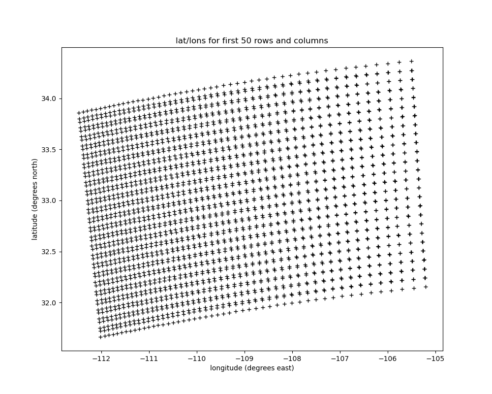

---
jupytext:
  cell_metadata_filter: all
  notebook_metadata_filter: all,-language_info,-toc,-latex_envs
  text_representation:
    extension: .md
    format_name: myst
    format_version: 0.13
    jupytext_version: 1.14.0
kernelspec:
  display_name: Python 3 (ipykernel)
  language: python
  name: python3
---

(assign1)=
# Assignment 1 -- brightness temperatures

Upload this notebook to canvas by 9am Friday January 26

In addition, upload your MYD02 hdf file, your `chan30_31.npz` file (described below)
and your `lonlat.npz` file (described below) to a folder on the a301hub inside the sat_data folder.

+++

## Problem 1 -- lat/lon scatter plot

Add a cell below that makes a scatterplot of the first 50 latitudes (y-coordinate) and longitudes (x-coordinate) for your scene

To do this first modify `modis_level1b_read.md` to add a cell to dump these latitudes to a numpy npz file called `lonlat.npz`  
(you don't have to hand in the modified md file). Add another cell to write out
the calibrated channel 30 and channel 31 radiances.

Then in this notebook, read in the lat/lon arrays from the `lonlat.npz` file 
and plot them.

Here is an excerpt of my code for the `modis_level1b_read.md`:
         
         # get the latitude variable
         latitude_data = the_file.select("Latitude")
         ...
         #read the first 50 rows and columns into a numpy array
         latitude_data = latitude_data[:50,:50]
         ...
         #save them to a npz file
         np.savez('lonlat.npz',longitude=longitude_data,latitude=latitude_data)
         
And here is what te plot looks like for my image:



         

+++

## Problem 2

In the cell below define a function that inverts the radiance (in MKS units) for the
brightness temperature in Kelvins.  Use the same format as the {ref}`sec:planck` notebook,
and use the %%writefile magic to output your function to a file called `planck_invert.py`

i.e. the top of the cell should look like:

```python
%%writefile planck_invert.py
def radiance_invert(wavelengths, Lstar):
   etc.
```

+++

## Problem 3

Read in the radiances for channel 30 and channel 31 from the file `chan30_31.npz`
you created above.
In the next cell import your `radiance_invert function` and use it to turn the calibrated
radiances into brightness temperatures
in Kelvins. 

Make 3 plots of the as an image, using a colorbar as in Modis level1b notebook. 

* First plot:  channel 30 temperatures
* Second plot: channel 31 temperatures
* Third plot: channel 31 - channel 30 temperatures

What is the sign of channel 31 - channel 30.  Why do you think the temperatures
are different in the two channels?
