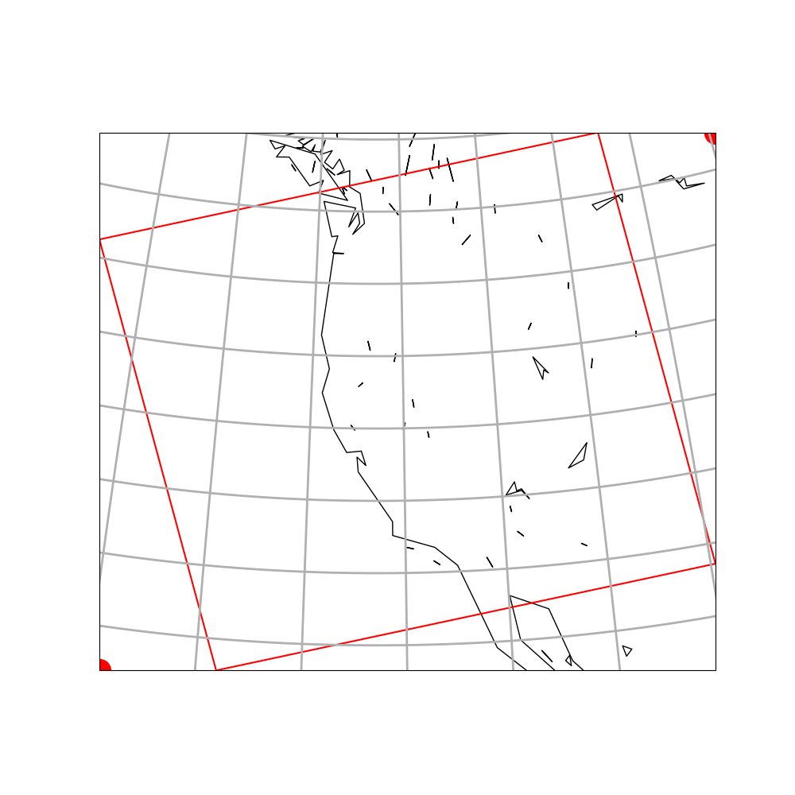

(assign2)=
# Assignment 2 -- Stull problems from chaps 2 and 8

  * Assignment 2a due Monday February 6, 11:59pm
    - Hand in a Jupter notebook that uses python to solve:
      - Stull Chapter 2 -- A23, A24, A25, A26(i)
      - Stull Chapter 8 -- A2, A4 -- using `rad_lib` functions

  * Copy your work to [assignment2a_handin.ipynb](https://github.com/phaustin/a301_students_eoas/blob/main/notebooks/assignments/assignment2a_handin.ipynb) for the upload to canvas.

  * Assignment 2b due Monday February 6, 11:59pm
    - Hand in a notebook that plots a map with a rectangle linking the corners
      of your Modis swath

  * Copy your work to [assignment2b_handin.ipynb](https://github.com/phaustin/a301_students_eoas/blob/main/notebooks/assignments/assignment2b_handin.ipynb) for the upload to canvas.

(assign2:solutionfig)=
## my solution to the 2b mapping question

